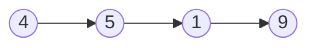

## 1. 题目描述

请编写一个函数，使其可以删除某个链表中给定的（非末尾）节点，你将只被给定要求被删除的节点。

现有一个链表 -- head = [4,5,1,9]，它可以表示为:



示例 1:

```
输入: head = [4,5,1,9], node = 5
输出: [4,1,9]
解释: 给定你链表中值为 5 的第二个节点，那么在调用了你的函数之后，该链表应变为 4 -> 1 -> 9.
```


示例 2:

```
输入: head = [4,5,1,9], node = 1
输出: [4,5,9]
解释: 给定你链表中值为 1 的第三个节点，那么在调用了你的函数之后，该链表应变为 4 -> 5 -> 9.
```


说明:

-   链表至少包含两个节点。
-   链表中所有节点的值都是唯一的。
-   给定的节点为非末尾节点并且一定是链表中的一个有效节点。
-   不要从你的函数中返回任何结果。

## 2. 解题思路

假设有如下链表，要删除 Yellow 节点：


对于单向链表，只能通过上一个节点访问下一个节点，删除节点时，如果以常规思路，将 Yellow 节点的上一个节点 Blue 的指针指向 Red 节点，这就需要访问 Blue 节点，这是很麻烦的，以这一思路，删除后的链表为：


换一种思路，用后一个节点覆盖要删除的节点，值和指针都覆盖。

这里只需要访问 Yellow 节点的下一个节点 Red，非常方便。

但从链表占用的存储空间上看，实际从链表中删除的空间，是删除节点的下一个节点的空间。

要删除 Yellow 节点，以这一思路，删除后的链表为：


## 3. 代码

```python
def deleteNode(node):
        node.val = node.next.val
        node.next = node.next.next
```

## 4. 完整代码下载

[下载地址](https://holsey.github.io/algorithm-cradle/LeetCode/237.删除链表中的节点/237.删除链表中的节点.py)

