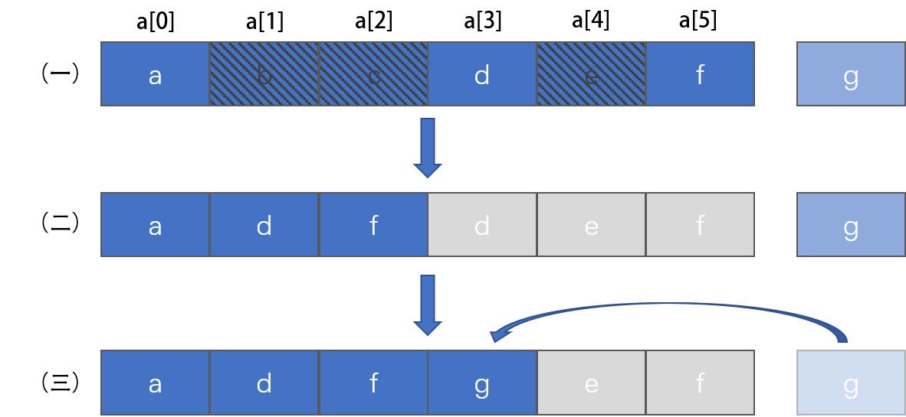
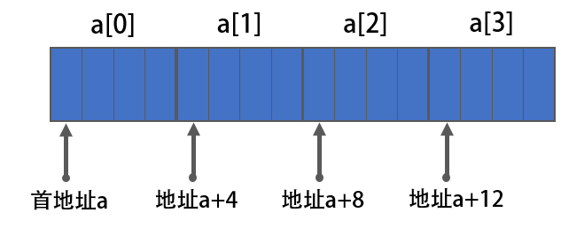

## 一、什么是数组

### 1.1 定义

数组（Array）是一种**线性表**数据结构。它用一组**连续的内存空间**，来存储一组具有**相同类型的数据**。

### 1.2 数组特性

1.   支持随机访问，**根据下标**随机访问的时间复杂度为 O(1)。

2.   连续的内存空间、相同类型的数据：因此可以随机访问，但为了保证**内存的连续性**，需要做大量的数据搬移工作，使增删等操作变得非常低效。

3.   线性存储，程序执行效率高。

### 1.3 时间复杂度

插入元素：O(n)，所插入位置后面的元素都要向后移动。

删除元素：O(n)，所删除位置后面的元素都要向前移动。

访问元素：O(1)，使用索引访问。

查找元素：与使用查找算法有关，如顺序查找、二分查找、插值查找等。

### 1.4 空间复杂度

数组只用来存储指定类型的数据，所以存储n个数据的空间复杂度为O(n)。


## 二、基本操作

### 2.1 插入数据

数组插入数据，**特定场景，特殊对待**，如下：

-   **数组需要保持有序**：将插入位置`k`后面的数据元素依次后移，空出要插入的位置，再将新元素插入。O(n)

-   **数组不需要保持有序**：将插入位置的旧元素移到最后，再在`k`处插入新元素。或直接将新元素放在最后。O(1)


### 2.2 删除数据

数组删除数据，**特定场景，特殊对待**，如下：

-   **考虑内存连续性**：

    -   **数组需要保持有序**：删除`k`位置元素后，将后面的元素依次前移一个位置。O(n)

    -   **数组不需要保持有序**：用最后一个元素覆盖要删除的元素。O(1)
-   **不考虑内存连续**：

    -   标记删除法，将要删除的元素标记（没有真正的删除），当数组空间不够时，一次性删除。但会造成内存不连续，如下图：



（一）存有`abcdef`的数组，将`bce`标记为删除（注意：此时数组的长度仍为`6`），此时想在数组末尾存入`g`

（二）因空间不够，将没有删除的元素`df`依次移动到`a`后面a[1]、a[2]的位置，并将数组长度标记为`3`（注意：此时a[3]、a[4]、a[5]的内存中仍存有`def`，只是不再计入数组长度）

（三）将`g`存入a[3]的位置。

这里澄清两个概念，`数组空间`和`数组长度`：

-   数组空间：数组所占内存空间，不随插入或删除元素而改变，除非申请空间
-   数组长度：数组所存储的数据元素个数，随插入或删除元素而改变


### 2.3 随机访问

以存储整型数据为例，



对于数组`int a[]`，其地址为`a`，第一个数组元素的地址和数组的地址相等，第二个数据元素的地址为`a+4`（由于存储整型，所以加4），依次类推，每往后移动一个数据元素，地址加4，可见只要知道了数组的首地址，就知道了数组中每一个元素的地址，所以利用数组下标可以实现数组元素的随机访问。

随机访问寻址方法：`a[i]_address = base_address + i * data_type_size`

其中，`base_address `为数组首地址，`data_type_size `为每个元素的大小，依数据类型确定。

代码验证一下：

```c
#include <stdio.h>

int main()
{
    int a[] = {0, 1, 2, 3};

    printf("   a.address: %p\n", a);
    for (int i = 0; i < 4; i++)
    { 
	printf("a[%d].address: %p\n", i, &a[i]);
    }
}
```

打印结果为：

```
   a.address: 0x7ffd46f51c50
a[0].address: 0x7ffd46f51c50
a[1].address: 0x7ffd46f51c54
a[2].address: 0x7ffd46f51c58
a[3].address: 0x7ffd46f51c5c
```

对于二维数组（多维数组），依然是线性存储的，寻址方式依然是通过元素下标。

二维数组寻址：对于 m * n 的二维数组，$a [ i ][ j ] (i < m, j < n)$的地址为：

`a[i][j]_address = base_address + ( i * n + j) * data_type_size`


### 2.4 查找数据

这里注意，查找和随机访问是不一样的，随机访问是给出索引（位置）返回数据元素的值，而查找一般是给出数据元素的值返回它的索引（位置）。

所以，数组查找操作的时间复杂度不是O(1)，要看使用的查找算法，比如二分查找，时间复杂度为 O(logn)。


## 三、基本操作代码实现

### 3.1 创建数组（为数组分配内存）

#### 3.1.1 c语言

##### 静态分配内存

内存分配在栈上，离开栈内存自动销毁。

可以直接创建数组并指定大小。

C99之前创建数组必须传入固定大小，如下：

```c
int num[10];
```

C99开始支持传入变量的变长数组

```c
int size = 10;
int num[size];
```

##### 动态分配内存

内存分配在堆上，需要使用free手动释放，否则直到程序结束才释放。

使用malloc函数分配内存，如：

```c
// 为数组分配一个可以存储10个int数据的内存空间
int* p_int = (int*)malloc(sizeof(int) * 10);
```

malloc分配的内存，在使用结束时要调用free函数手动释放：

```c
free(p_int);
```


### 3.2 初始化数组

#### 3.2.1 c语言

可以在创建时初始化，也可以创建后再初始化。

1.   创建时初始化可以不写大小，申请空间时通过数据元素个数计算大小。

```c
int num[] = {1, 2, 3};
```

2.   在自定义函数中，如果数组创建后没有初始化，数组会被随机值填充。
3.   在全局域或`main`函数中，如果数组创建后没有初始化，数组会被`0`填充。
4.   当创建时初始化，初始化的元素个数比数组申请的大小少，即没有将数组所有元素初始化，未初始化的数组元素将被`0`填充。

代码验证如下：

```c
#include <stdio.h>

// 全局域创建数组
int num1[3];
int num5[3] = {1};

void init_array()
{
    // 自定义函数局部域
    int num3[3];
    int num4[3] = {1};
    printf("自定义函数num3[1]: %d\n", num3[1]);
    printf("\n打印数组创建时初始化，未被初始化的元素\n");
    printf("自定义函数num4[1]: %d\n", num4[1]);
}

int main()
{
    printf("打印数组创建时未初始化，数组的元素\n");
    printf("全局域num1[1]: %d\n", num1[1]);
    int num2[3];
    printf("main函数num2[1]: %d\n", num2[1]);

    init_array();
    
    printf("全局域num5[1]: %d\n", num5[1]);
    int num6[3] = {1};
    printf("main函数num6[1]: %d\n", num6[1]);
    
    return 0;
}
```

打印结果如下：

```
打印数组创建时未初始化，数组的元素
全局域num1[1]: 0
main函数num2[1]: 0
自定义函数num3[1]: 21899

打印数组创建时初始化，未被初始化的元素
自定义函数num4[1]: 0
全局域num5[1]: 0
main函数num6[1]: 0
```


### 3.3 获取数组大小

#### 3.3.1 c语言

##### 数组容量大小（最多能存储的数据个数）

想要获取数组的内存大小，可以使用sizeof函数

```c
int arr[10];
int max_size = sizeof(arr)/sizeof(arr[0]);
```


##### 数组当前存储数据的个数（面向对象思想）

实际上我们需要的，常常是数组存储数据的个数，而不是数组最多能存储多少和数据，如果数组一开始分配内存比实际存储的数据所占内存大（实际上常常就是这样），就需要使用另一种方法了。

常用的是面向对象的思想，不要以为c语言是面向过程的语言，其实它早已偷偷加入了面向对象的东西，而且面向对象的思想，是思想，可以用任何语言实现。

利用c语言的结构体，创建一个数组结构体类型，每次操作数据记录当前长度。

```c
// 以动态分配内存为例
typedef struct{
	int* data;		// 数组的首地址
	int  length;    // 数组的当前长度  
    int  maxSize;   // 数组最大容量大小
} Array;
```


### 3.4 插入元素

#### 3.4.1 不需保证数组元素原有排序

当不需要保证数组元素原有排序时，不用指定插入位置，直接使用尾插法，不用移动元素，时间复杂度为O(1)

```c
bool insertBack(Array* array, int num)
{
    if (array->length >= array->maxSize)
    {
        return false;
    }
    array->pData[array->length] = num;
    array->length++;

    return true;
}
```


#### 3.4.2 需保证数组元素原有排序

当需要保证数组元素原有排序时，要指定插入位置，并且插入位置以后元素都要后移，为新元素腾出位置。

```c
bool insert(Array* array, int index, int num)
{
    if (array == NULL || array->pData == NULL || array->length > array->maxSize)
    {
        return false;
    }

    for (int i = array->length; i > index; i--)
    {
        array->pData[i] = array->pData[i-1];
    }
    array->length++;
    array->pData[index] = num;

    return true;
}
```

当原数组无数值顺序，需要人为指定插入位置。

当原数组有数值顺序，要先将新元素的数值与原数组元素比较大小，找到对应位置，再调用上面函数。


### 3.5 删除元素

和插入元素一样，如果不需保证原有数组的顺序，需把最后一个元素覆盖要删除的元素即可，时间复杂度O(1)。

如果需保证原有数组的顺序，删除位置以后的元素要往前移动，以保证数组内存的连续性，时间复杂度O(n)。

以上复杂度只是删除操作的复杂度，如果需要查找定位，就另说了。这里仅说明需保证原有数组顺序的情况。

根据提供的数据不同，可分为以下两种方法：

#### 3.5.1 指定索引删除

找到给定位置，将此位置后面的元素前移，把该位置的元素覆盖即可。

```c
bool removeWithIndex(Array* array, int index)
{
    if (array == NULL || array->pData == NULL || array->length > array->maxSize)
    {
        return false;
    }

    for (int i = index+1; i < array->length; i++)
    {
        array->pData[i-1] = array->pData[i];
    }
    array->length--;

    return true;
}
```


#### 3.5.2 指定数值删除

这里涉及了查找操作，需要先根据数值查找定位元素，再执行删除操作。

这里以穷举遍历查找为例，仅说明一下删除操作：

```c
bool removeWithValue(Array* array, int value)
{
    if (array == NULL || array->pData == NULL || array->length > array->maxSize)
    {
        return false;
    }

    int tmpArray[array->length];
    int j = 0;
    for (int i = 0; i < array->length; i++)
    {
        if (array->pData[i] == value)
        {
            continue;
        }
        tmpArray[j++] = array->pData[i];
    }
    array->pData = tmpArray;
    array->length = j;

    return true;
}
```


### 3.6 访问元素

访问元素可以通过下标访问，也可以通过指针访问。

```c
// 下标
int arr[10];
arr[1] = 2;
int a = arr[1];

// 指针
int arr[10];
*arr = 2; // 等价于arr[0] = 2;
int a = *(arr+1); // 等价于a = arr[1];
```


### 3.7 查找元素

不同情况使用不同查找算法。


## 四、其他关于数组的问题

### 3.1 数组越界问题

数组申请的内存是有限的，如果访问的内存不属于数组，就会发生数组越界问题。

```
int main(int argc, char* argv[])
{
    int i = 0;
    int arr[3] = {0};
    for(; i<=3; i++)
    {
        arr[i] = 0;
        printf("hello world!\n");
    }
    return 0;
}
```

这一段程序数组越界了，输出结果和内存地址分配方式有关。

函数体内的局部变量存在栈上，且是连续压栈。在Linux进程的内存布局中，栈区在高地址空间，从高向低增长。变量`i`和`arr`在相邻地址，在内存分配时，如果按照内存地址递减的方式进行分配，则`i`比`arr`的地址大，那么`arr`越界正好访问到`i`。当然，前提是`i`和`arr`元素同类型，否则那段代码仍是未决行为。这时无限循环输出hello world。

如果按照内存地址递增的方式进行分配，则`i`比`arr`的地址小，那么`arr`越界正好访问不到`i`，这时只输出4次hello world。


### 3.2 数组下标为什么从0开始？

从数组存储的内存模型上来看，`下标`最准确的定义应该是`偏移（offset）`。第一个元素的偏移为0，第`i`个元素的偏移为`i`。但如果从1开始，第`i`个元素的偏移就为`i-1`，多了一次减法运算，这将降低CPU的运算效率。（对于底层算法开发，效率优化要做到极致。）