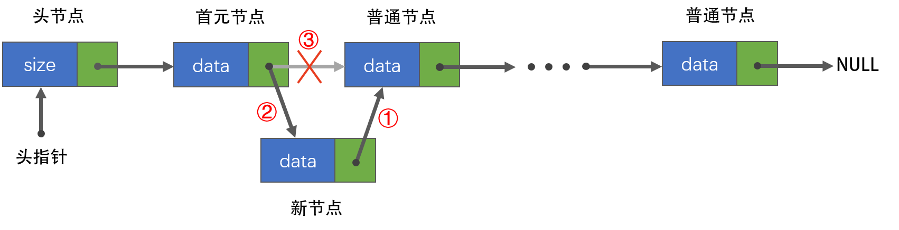

## 一、什么是链表

### 1.1 定义

根据数据的存储结构，数据结构可分为数组和链表。

数组：连续的内存空间。

链表：离散的内存空间。

链表通过指针将一组离散的内存块串联在一起。每个内存块称为链表的 `节点`，每个节点包含数据域和指针域。

链表相关知识点如下：


### 1.2 特点

1.   动态分配存储空间，无需预先估计存储空间，使用灵活。
2.   消耗内存空间大，除存储数据外，还需存储地址。
3.   插入和删除效率高，由于使用指针连接各节点，插入和删除时只需改变指针指向即可，无需移动其他元素，时间复杂度O(1)。
4.   随机访问效率低，由于内存空间不连续，访问节点时需要从第一个节点遍历链表，时间复杂度O(n)。
5.   一定要保证尾节点的指针指向NULL
6.   每一个节点要至少被一个指针指向。


### 1.3 节点分类

头节点：数据域为空，或存放链表大小，指针域存储首元节点的地址，对于一个链表，头节点不是必须的。（为了统一操作，无头空链表使用尾插法，首元结点的处理与其他不同）

首元节点：链表存储第一个数据元素的节点。

尾节点：链表存储最后一个数据元素的节点。

头指针：指向链表的第一个节点，有头节点指向头节点，没有头节点则指向首元节点。


## 二、单链表

### 2.1 定义

单链表通过任意的存储单元存储线性表中的数据元素，每个节点由`数据域`和`指针域`两部分组成，如下图，其中data为数据域，存放数据元素，next为指针域，存放其直接后继节点的地址。


### 2.2 特点

1.   单链表只能单向遍历
2.   为了统一所有节点的处理方法，可增加头节点，对于一个链表来说，头节点可有可无。

带头结点的单链表如下：


不带头结点的单链表如下：


### 2.3 基本操作原理与实现

| 序号 |  基本操作  |                             描述                             |
| :--: | :--------: | :----------------------------------------------------------: |
|  1   | initial()  |                       构造/初始化链表                        |
|  2   |  insert()  |                           插入元素                           |
|  3   |  delete()  |                           删除元素                           |
|  4   |   find()   |           按值查找，如存在返回地址，不存在返回null           |
|  5   |   size()   |               获取链表大小，即链表中元素的个数               |
|  6   | getValue() | 取值，链表不支持下标访问（当然可以实现，但也是通过指针实现的），所以用指针取出指向的节点的值 |
|  7   |  empty()   |                             判空                             |
|  8   | reverse()  |                             反转                             |
|  9   | destory()  |                           销毁链表                           |

#### 2.3.1 初始化链表

就像手机电脑的配置一样，链表也有不同的配置，没有哪个更好，只有哪个适合当前的需求，基本配置项如下：

1. 是否为空
2. 头节点
3. 尾指针
4. 记录表长（大小）

链表初始化不同配置如下：

|                               | 头指针 | 头节点 | 成员节点 | 尾指针 | 记录大小 |
| :---------------------------- | :----: | :----: | :------: | :----: | :------: |
| 0. 不带头节点的空链表         |   ✔    |   ✘    |    ✘     |   ✘    |    ✘     |
| 1. 带头节点的空链表           |   ✔    |   ✔    |    ✘     |   ✘    |   ✘/✔    |
| 2. 带头节点的非空链表(头插法) |   ✔    |   ✔    |    ✔     |   ✘    |   ✘/✔    |
| 3. 带头节点的非空链表(尾插法) |   ✔    |   ✔    |    ✔     |   ✔    |   ✘/✔    |


首先定义一下节点类型，数据域为`int`类型，指针域为`struct Node`类型： 

```c
typedef struct Node
{
    int data;
    struct Node* next;
} node;
```


##### 0. 不带头节点的空链表

直接头指针指向NULL。


创建一个`node`类型的指针，并令其指向`NULL`。

```c
node* initial_nohead_null()
{
    node* head = NULL; // head为头指针

    return head;
}
```


##### 1. 带头节点的空链表

只为链表分配基本的空间，包含头节点、头指针，头指针指向头节点，头节点的指针指向NULL，其中头节点数据域为空。


创建一个头节点，并使头指针指向它，令头节点的指针指向NULL。

```c
node* initial()
{
    node* head = (node*)malloc(sizeof(node)); // 创建一个头结点，head为头指针
    head->next = NULL;

    return head;
}
```


##### 2. 带头节点的非空链表(头插法)

先为链表分配基本的空间，包含头节点、头指针，头指针指向头节点，头节点的指针指向NULL，其中头节点数据域记录链表大小（当然也可以选择不记录）。

然后，使用`头插法`为链表添加初始化数据节点。


这里简单介绍一下`头插法`，每次在链表的头部插入节点，即每次插入新节点都是在`头节点`和`首元节点`之间插入，如下图：


如果使用头插法为一个空链表依次插入 `10, 20, 30, 40` 四个数，则链表结果会为：


即节点排列顺序与插入先后顺序相反，尾节点是第一个插入的节点，首元节点是最后一个插入的节点。


关于初始化函数，根据场景不同，入参也有不同的方式，比如直接输入初始化元素值、使用现有链表、初始化为多个相同的值、使用数组等等。

```c
// 直接输入初始化元素值，利用不定参数实现(头插)
node* initial_head_arglist_h(int num_of_data, ...)
{
    va_list arg_list;
    va_start(arg_list, num_of_data);
    node* head = (node*)malloc(sizeof(node)); // 创建一个头结点，head为头指针
    head->data = num_of_data;   // 头节点记录链表大小
    head->next = NULL;

    // 为链表添加节点
    for (int i = 0; i < num_of_data; i++)
    {
        node* tmp = (node* )malloc(sizeof(node));
        tmp->data = va_arg(arg_list, int);
        tmp->next = head->next;
        head->next = tmp;
    }
    va_end(arg_list);
    return head;
}
```


```c
// 利用数组初始化链表(头插)
node* initial_head_array_h(int size, int* array)
{
    node* head = (node*)malloc(sizeof(node)); // 创建一个头结点，head为头指针
    head->data = size;    // 头节点记录链表大小
    head->next = NULL;

    // 为链表添加节点
    for (int i = 0; i < size; i++)
    {
        node* tmp = (node* )malloc(sizeof(node));
        tmp->data = array[i];
        tmp->next = head->next;
        head->next = tmp;
    }

    return head;
}
```


##### 3. 带头节点的非空链表(尾插法)

尾插法即每次在链表的尾部插入节点，如下图：


这里多了一个`尾指针`，它始终指向尾节点，由于快速找到尾节点，并对尾节点进行操作。

如果使用尾插法为一个空链表依次插入 `10, 20, 30, 40` 四个数，则链表结果会为：


即节点排列顺序与插入先后顺序相同，首元节点是第一个插入的节点，尾节点是最后一个插入的节点。

尾插法初始化链表的例程如下：

```c
// 利用不定参数初始化链表(尾插)
node* initial_head_arglist_t(int num_of_data, ...)
{
    va_list arg_list;
    va_start(arg_list, num_of_data);
    node* head = (node*)malloc(sizeof(node)); // 创建一个头结点，head为头指针
    head->data = num_of_data;   // 头节点记录链表大小
    head->next = NULL;
    node* tail = head; // 尾指针

    // 为链表添加节点
    for (int i = 0; i < num_of_data; i++)
    {
        node* tmp = (node* )malloc(sizeof(node));
        tmp->data = va_arg(arg_list, int);
        tmp->next = NULL;
        tail->next = tmp;
        tail = tail->next;
    }
    va_end(arg_list);
    return head;
}
```


```c
// 利用数组初始化链表(尾插)
node* initial_head_array_t(int size, int* array)
{
    node* head = (node*)malloc(sizeof(node)); // 创建一个头结点，head为头指针
    head->data = size;   // 头节点记录链表大小
    head->next = NULL;
    node* tail = head;   // 尾指针

    // 为链表添加节点
    for (int i = 0; i < size; i++)
    {
        node* tmp = (node* )malloc(sizeof(node));
        tmp->data = array[i];
        tmp->next = NULL;
        tail->next = tmp;
        tail = tail->next;
    }

    return head;
}
```


#### 2.3.2 插入元素

这里的插入操作和初始化链表时的插入操作一样，都是通过改变节点指针的指向实现的。



其中，为了防止指针断开后，后面的链表丢失，不要先执行3，要按照123的顺序，把新节点插入后再断开原有节点的指针。

例程如下：

```c
bool insert_pos(node* p_head, int pos, int data)
{
    // 建议记录链表长度并判断，否则需要调用时保证插入位置有效，避免访问越界
    if (p_head == NULL || pos > p_head->data)
    {
        printf("插入位置无效.\n");
        return false;
    }

    node* p_tmp = p_head;
    
    // 首先找到要插入位置的上一个结点
    for (int i = 0; i < pos; i++)
    {
        p_tmp = p_tmp->next;
    }
    // 创建插入结点c
    node* p_new = (node*)malloc(sizeof(node));
    p_new->data = data;
    // 向链表中插入结点
    p_new->next = p_tmp->next;
    p_tmp->next = p_new;
    p_head->data++;
    
    return true;
}
```


#### 2.3.3 删除元素

删除元素即将要删除的节点跳过，再释放该节点的内存。


由于单链表只能单向访问，所以遍历时不只是要找到要删除的节点，还要找到它的直接前驱节点，使其直接前驱节点的指针域存储其直接后继节点的地址。

遍历时，使用双指针的办法，一个指向要删除的节点，一个指向其直接前驱节点，如下图：


然后，令其直接前驱节点指向其直接后继节点（跳过要删除的节点），`p_pre->next = p_pre->next->next;` 如下图：


最后，释放要删除的节点的内存，`free(p_del);` ，如下图：


例程如下：

按索引删除：

```c
bool delete_index(node* p_head, int index)
{
    if (p_head == NULL || index > p_head->data)
    {
        printf("没有该结点\n");
        return false;
    }

    // 遍历到被删除结点的直接前驱结点
    node* p_pre = p_head;
    for (int i = 0; i < index; i++)
    {
        p_pre = p_pre->next;
    }

    node* p_del = p_pre->next; // 单独设置一个指针指向被删除结点，以防丢失
    p_pre->next = p_del->next; // 删除某个结点的方法就是更改前一个结点的指针域
    p_head->data--;
    free(p_del);               // 手动释放该结点，防止内存泄漏

    return true;
}
```


按值删除，删除链表中所有数据域值为del的节点：

```c
bool delete_value(node* p_head, int del)
{
    if (p_head == NULL || p_head->next == NULL)
    {
        printf("链表为空\n");
        return false;
    }

    node* p_pre = p_head;
    node* p_del = p_pre->next;

    int i = 0;
    while (p_del != NULL)
    {
        while (p_del->data != del)
        {
            p_pre = p_pre->next;
            if (p_pre->next != NULL)
            {
                p_del = p_pre->next;
            }
            else if (i == 0)
            {
                printf("链表中不存在该值\n");
                return false;
            }
            else
            {
                return true;
            }
        }
        i++;
        p_pre->next = p_del->next;
        free(p_del);
        p_del = p_pre->next;
        p_head->data--;
    }

    return true;
}
```


#### 2.3.4 查找元素

查找元素有很多优秀的算法，这里只介绍顺序查找。

顺序查找即依次遍历每个节点，检查该节点是否为要查找的节点，直到找到要找的节点或遍历结束。

例程如下：

返回第一个找到的节点：

```c
bool find_first(node* p_head, int value, int* index)
{
    if (p_head == NULL || p_head->next == NULL)
    {
        printf("链表为空\n");
        *index = -1;
        return false;
    }

    node* p_tmp = p_head;
    int i = 0;
    while (p_tmp->next)
    {
        p_tmp = p_tmp->next;
        if (p_tmp->data == value)
        {
            *index = i;
            return true;
        }
        i++;
    }
    *index = -1;
    return false;
}
```


返回最后一个找到的节点：

```c
bool find_last(node* p_head, int value, int* index)
{
    *index = -1;
    
    if (p_head == NULL || p_head->next == NULL)
    {
        printf("链表为空\n");
        return false;
    }

    node* p_tmp = p_head;
    int i = 0;
    while (p_tmp->next)
    {
        p_tmp = p_tmp->next;
        if (p_tmp->data == value)
        {
            *index = i;
        }
        i++;
    }

    if (*index == -1)
    {
        return false;
    }
    else
    {
        return true;
    }
}
```


返回所有找到的节点：

```c
typedef struct Array
{
    int size;
    int* array;
} array;

bool find_all(node* p_head, int value, array* p_result)
{
    if (p_head == NULL || p_head->next == NULL)
    {
        printf("链表为空\n");
        p_result->size = 0;
        return false;
    }

    node* p_tmp = p_head;
    int* p_array = (int*)malloc(sizeof(int) * p_tmp->data);

    int i = 0;
    int size = 0;
    int index = -1;
    while (p_tmp->next)
    {
        p_tmp = p_tmp->next;
        if (p_tmp->data == value)
        {
            p_array[size] = i;
            size++;
        }
        i++;
    }

    p_result->size = size;

    if (size == 0)
    {
        return false;
    }

    p_result->array = (int*)malloc(sizeof(int) * size);
    for (int i = 0; i < size; i++)
    {
        p_result->array[i] = p_array[i];
    }

    free(p_array);

    return true;
}
```


#### 2.3.5 获取链表大小

可以使用头节点记录链表的大小，然后通过头指针访问头节点的数据域，或封装成函数。

```c
bool size(node* p_head, int* size)
{
    if (p_head == NULL)
    {
        return false;
    }

    *size = p_head->data;

    return true;
}
```


#### 2.3.6 访问节点/取值

链表不能像数组一样随机访问，无论是通过值访问还是按照索引访问，都需要依次遍历节点，直到找到目标节点。

```c
bool get_value(node* p_head, int index, int* value)
{
    if (p_head == NULL || p_head->next == NULL)
    {
        printf("链表为空\n");
        return false;
    }

    node* p_tmp = p_head;
    for (int i = 0; i < p_head->data; i++)
    {
        p_tmp = p_tmp->next;
        if (i == index)
        {
            *value = p_tmp->data;
            return true;
        }
    }

    return false;
}
```


#### 2.3.7 链表判空

```c
bool empty(node* p_head)
{
    if (p_head == NULL || p_head->next == NULL)
    {
        return true;
    }

    return false;
}
```


#### 2.3.8 反转链表

https://blog.csdn.net/weixin_46097480/article/details/114880504


#### 2.3.9 清空链表/销毁链表

清空链表：释放链表除头节点以外的所有节点内存（即删除这些节点）。

销毁链表：释放链表的所有节点内存（包括头节点），并将头指针置空；


清空链表：

```c
node* amendElem(node* p_head, int add, int newElem)
{
    node* p_tmp = p_head;
    p_tmp = p_tmp->next; // tamp指向首元结点
    // temp指向被删除结点
    for (int i = 1; i < add; i++)
    {
        p_tmp = p_tmp->next;
    }
    p_tmp->data = newElem;
    return p_head;
}
```


销毁链表：

```c
void destory(node** p_head_addr)
{
    node* p_head = *p_head_addr;
    if (p_head == NULL)
    {
        return;
    }

    node* p_tmp = p_head;
    while (p_head != NULL)
    {
        p_head = p_head->next;
        free(p_tmp);
        p_tmp = p_head;
    }
    *p_head_addr = NULL;
}
```


## 三、双链表

### 3.1 定义

双链表与单链表的唯一不同就是，双链表可以反向访问节点的前驱节点，所以叫做双向链表。   


### 3.2 特点


