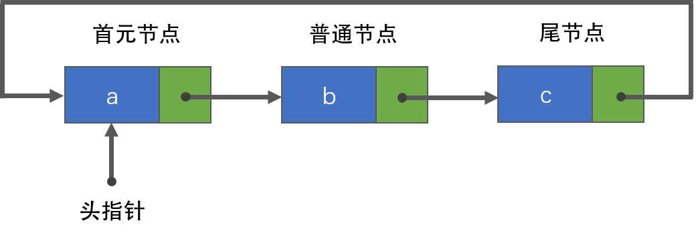

## 一、线性表定义

n个相同数据类型的数据元素组成的有限序列称为`线性表`。

### 1.1 基本逻辑特性

1.   线性表的第一个数据元素称为`表头元素`，最后一个数据元素称为`表尾元素`
2.   除表头元素外，线性表中每一个数据元素有且仅有一个`直接前驱`
3.   除表尾元素外，线性表中每一个数据元素有且仅有一个`直接后继`

### 1.2 基本特点

由定义与基本逻辑特性可以推到出线性表的以下特点：

1.   表中元素个数有限
2.   表中元素具有逻辑上的顺序性，表中元素有先后次序
3.   表中元素的数据类型相同，每个元素所占存储空间大小相同
4.   表中元素具有抽象性，仅讨论元素间的逻辑关系，不考虑元素代表什么内容。
5.   线性表元素间是1对1的逻辑关系

### 1.3 基本操作

一个数据结构的基本操作是指其最核心、最基础的操作。其他较复杂操作都可以通过基本操作实现。

| 序号 |     基本操作      |                        描述                         |
| :--: | :---------------: | :-------------------------------------------------: |
|  1   |   InitList(&L)    |            初始化表。构造一个空线性表L。            |
|  2   |     Length(L)     |    求表长。返回线性表L的长度，即表中元素的个数。    |
|  3   | LocateElem(L, e)  |       按值查找。获取表L中给定值e的元素位置。        |
|  4   |   GetElem(L, i)   |     按索引查找。获取表L中给定位置i的元素的值。      |
|  5   | Insert(&L, i, e)  |       插入元素。在表L中给定位置i处插入元素e。       |
|  6   | Delete(&L, i, &e) | 删除元素。删除表L中给定位置i处的元素，并返回其值e。 |
|  7   |   PrintList(L)    |        打印表。按先后顺序打印表L的所有元素。        |
|  8   |     Empty(L)      |               判空。判断表L是否为空。               |
|  9   |  DestoryList(&L)  |   销毁表。销毁线性表L，并释放其所占用的内存空间。   |

## 二、线性表的存储结构

线性表是一种逻辑结构，实现这种逻辑结构时，可以使用不同的存储结构，有`顺序存储结构` 和 `链式存储结构` ，根据存储结构的具体分类如下图：

可以发现，图中还有栈、队列、串，他们也属于线性表，是受限线性表，分类如下：

### 2.1 顺序表（数组）

#### 2.1.1 定义

顺序存储结构使用一组地址连续的内存来存储表中的数据元素。

以顺序存储结构实现的线性表称为`顺序表`。

#### 2.1.2 特点

1.   顺序表中数据元素的逻辑顺序与物理顺序（存储顺序）相同。
2.   顺序表中任一元素都可以随机访问，复杂度O(1)。（顺序存储结构是一种随机存储结构）
3.   插入和删除操作效率低，复杂度O(n)。
4.   存储密度大，每个节点只存储数据。

### 2.2 链表

链式存储不需要使用地址连续的内存来存储数据，它使用指针来连接每个节点。

以链式存储结构实现的线性表称为`链表`。

根据元素间指针及链表结构的不同，链表又分为`单链表`、`双链表`和`循环链表`。

#### 2.2.1 单链表

#### 2.2.1.1 定义

单链表通过任意的存储单元存储线性表中的数据元素，每个节点由`数据域`和`指针域`两部分组成，如下图，其中data为数据域，存放数据元素，next为指针域，存放其直接后继节点的地址。

#### 2.2.1.2 特点

首元节点：链表存储第一个数据元素的节点。

头节点：数据域为空，或存放链表大小，指针域存储首元节点的地址，对于一个链表，头节点不是必须的。（为了统一操作，无头空链表使用尾插法，首元结点的处理与其他不同）

头指针：指向链表的第一个节点，有头节点指向头节点，没有头节点则指向首元节点。

带头结点的单链表如下：

不带头结点的单链表如下：

#### 2.2.2 双链表

#### 2.2.2.1 定义

双链表与单链表类似，不同的是双链表有两个指针域，prior存放其直接前驱节点的地址，next存放其直接后继节点的地址。

#### 2.2.2.2 特点

1.   单链表只能从前往后查找，不能从后往前查找，双链表弥补了这一缺点。
2.   双链表虽然可以双向查找，但头指针只有一个。

双链表示意图如下：

#### 2.2.3 循环链表

#### 2.2.3.1 定义

把单链表尾节点的指针指向头节点或首元节点，就形成了单循环链表。

把双链表尾节点的指针指向头节点或首元节点，就形成了双循环链表。

#### 2.2.3.2 示意图

虽然循环链表成环状，但仍属于链表，所以仍可找到头指针、头节点、首元节点等。

单循环链表示意图如下：

双循环链表示意图如下：

